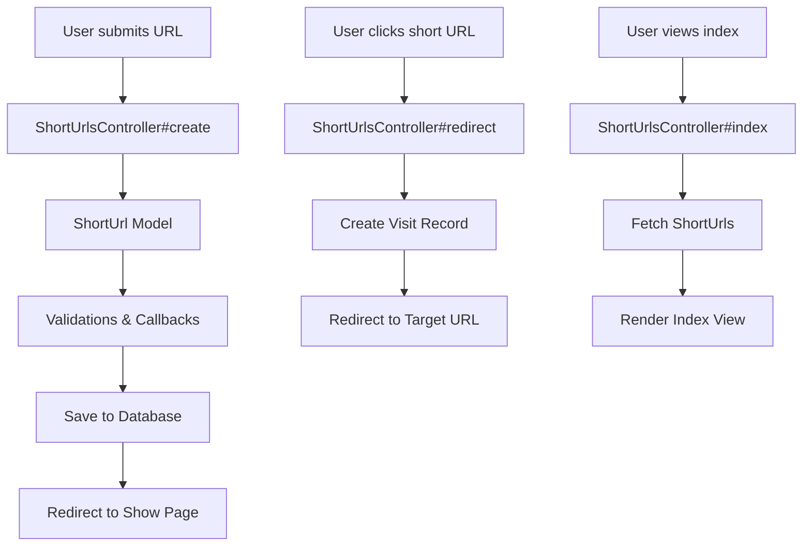

# Architecture Overview

This document describes the architecture of the URL Shortener Rails application.

## High-Level Architecture

The application follows a standard MVC (Model-View-Controller) pattern with Rails conventions.

### Components

- **Models**: Handle data and business logic
- **Controllers**: Manage HTTP requests and responses
- **Views**: Render HTML for the user interface
- **Database**: SQLite for persistence
- **Routes**: Define URL mappings

### Key Features

- URL shortening with unique paths
- Visit tracking with geolocation
- Automatic title fetching
- RESTful API design

## Data Flow



## Models

### ShortUrl
- **Attributes**: path, target_url, title, created_at, updated_at
- **Associations**: has_many :visits
- **Validations**: presence, uniqueness, custom URL validation
- **Callbacks**: normalize URL, generate path, fetch title

### Visit
- **Attributes**: ip_address, visited_at
- **Associations**: belongs_to :short_url
- **Validations**: presence
- **Callbacks**: geocode IP address

## Controllers

### ShortUrlsController
- **Actions**: index, new, create, show, redirect
- **Responsibilities**: CRUD operations, visit tracking

## Views

- **Layouts**: application.html.erb
- **ShortUrls**: index.html.erb, new.html.erb, show.html.erb
- **Visits**: index.html.erb

## Database Schema

```sql
CREATE TABLE short_urls (
  id INTEGER PRIMARY KEY,
  path VARCHAR(15) UNIQUE,
  target_url TEXT,
  title TEXT,
  created_at DATETIME,
  updated_at DATETIME
);

CREATE TABLE visits (
  id INTEGER PRIMARY KEY,
  short_url_id INTEGER,
  ip_address VARCHAR,
  visited_at DATETIME,
  latitude FLOAT,
  longitude FLOAT,
  FOREIGN KEY (short_url_id) REFERENCES short_urls(id)
);
```

## Routes

```ruby
Rails.application.routes.draw do
  root 'short_urls#index'
  resources :short_urls
  get '/:path', to: 'short_urls#redirect', as: :short_url_redirect
  get 'visits/index'
end
```

## Dependencies

- Rails 7.2+
- SQLite3
- Nokogiri (for HTML parsing)
- Geocoder (for IP geolocation)

## Security

- CSRF protection
- Parameter whitelisting
- Input validation</content>
<parameter name="filePath">ARCHITECTURE.md